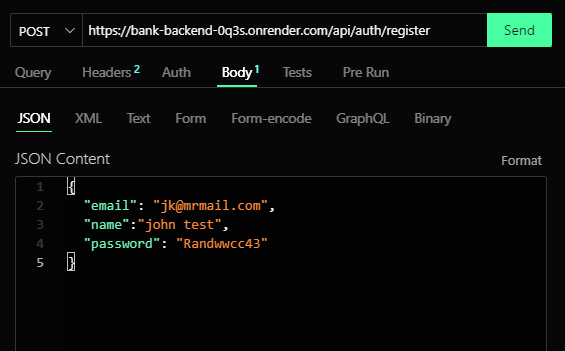
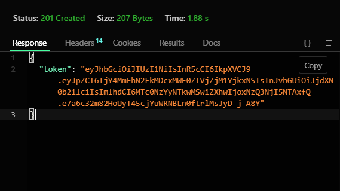

# 💰 Bank Backend API

An Express.js backend for a banking application that provides secure user authentication, account management, and administrative controls.

## 🚀 Features

- User Registration and Authentication (JWT-based)
- Role-based Authorization (Admin/User)
- Create, Update, and View Bank Accounts
- Admin-only access to manage users and accounts
- MongoDB integration with Mongoose
- API documentation with Swagger
- Environment-based configuration
- Nodemon for live reloading

---

## 📁 Project Structure

```
bank-backend/
│
├── bin/                  # Server entry point
├── config/               # Database and config setup
├── controllers/          # Route logic
├── middleware/           # Custom middleware (auth, admin check)
├── models/               # Mongoose models (User, Account)
├── routes/               # Route definitions
├── src/
│   └── utils/            # Utility functions
├── swagger/              # Swagger docs configuration
├── .env                  # Environment variables
├── app.js                # Express app
├── package.json
└── README.md
```

---

## ⚙️ Getting Started

### 1. Clone the Repository

```bash
git clone https://github.com/mrrmartin01/bank-backend.git
cd bank-backend
```

### 2. Install Dependencies

```bash
yarn install
```

### 3. Create `.env` File

```env
PORT=5000
MONGO_URI=mongodb://localhost:27017/bank_db
JWT_SECRET=your_jwt_secret
```

> 💡 Create a secure, unique `JWT_SECRET`.

### 4. Run in Development Mode

```bash
yarn dev
```

> Uses `nodemon` for hot-reloading.

---

## 🔐 API Authentication

- Uses **JWT** for protected routes
- Send token in the `Authorization` header:  
  `Bearer <token>`

---

## 🧪 Sample Routes

### 🧍‍♂️ Auth

| Method | Endpoint         | Description       |
|--------|------------------|-------------------|
| POST   | `/auth/register` | Register user     |
| POST   | `/auth/login`    | Login user        |

#### 📦 Sample Payload

```json
// Register
{
  "name": "John Doe",
  "email": "john@example.com",
  "password": "secure123"
}



## Response with token


//!And yes it's superfast 

// Login
{
  "email": "john@example.com",
  "password": "secure123"
}
```

### 👤 Profile

| Method | Endpoint         | Description                |
|--------|------------------|----------------------------|
| PATCH  | `/profile`       | update user profile        |


### 👤 Users(coming soon)

| Method | Endpoint         | Description                |
|--------|------------------|----------------------------|
| PATCH  | `/users/:id`     | Admin update user profile  |


### 🏦 Accounts

| Method | Endpoint           | Description                 |
|--------|--------------------|-----------------------------|
| POST   | `/accounts`        | Create account              |
| PATCH  | `/accounts/update` | Update account (user/admin) |


#### 📦 Sample Account Payload

```json
{
  "accountType": "savings",
  "balance": 500
}
```

---

## 🧰 Scripts

| Command       | Description         |
|---------------|---------------------|
| `yarn start`  | Start server        |
| `yarn dev`    | Start with nodemon  |

---

## 📚 API Documentation

After starting the server, visit:

```
http://localhost:5000/api-docs
```

- Powered by Swagger UI
- Live testing supported

---

## 🔐 Roles

| Role  | Permissions                                   |
|-------|-----------------------------------------------|
| User  | Manage own account                            |
| Admin | Manage users and all accounts                 |

---

## ✅ Todo

- [x] User authentication
- [x] Account creation & update
- [x] Admin-only access control
- [x] Swagger documentation
- [ ] Transactions (Deposit, Withdraw, Transfer)
- [ ] Activity logging
- [ ] Unit & integration tests

---

## 🛠️ Technologies Used

- **Node.js** + **Express**
- **MongoDB** + **Mongoose**
- **JWT** (JSON Web Token)
- **Nodemon** for dev reload
- **Swagger** for docs
- **Yarn** as package manager

---

## 🤝 Contributing

Feel free to fork and contribute! Pull requests are welcome.

